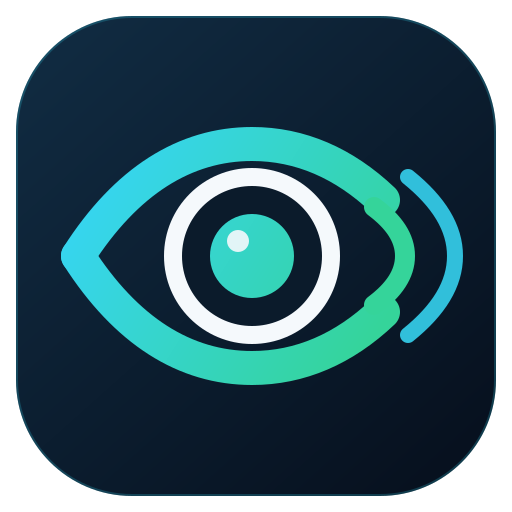
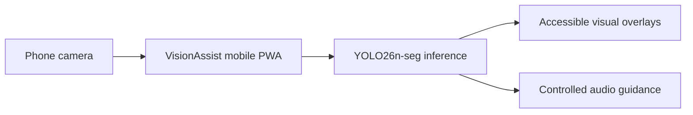

# VisionAssist

### AI Visual Assistant for Reduced Vision

## About

VisionAssist is an assistive-vision system for people with reduced vision. It
turns camera input into useful spatial context through computer vision,
accessible visual overlays, and controlled audio guidance.

The current product is a mobile PWA powered by **YOLO26n-seg on CPU**. It is
designed to scale toward smart glasses as the primary point of view, with a
phone as an optional companion and cloud inference for concise audio or haptic
guidance.

## Global impact

- **2,200 million** people have vision impairment (WHO)
- **1 billion** have moderate or severe distance vision impairment
- The affected population is projected to **double by 2050**
- **250 million** are of working age

## What it delivers

- **Real-time object detection and segmentation** with YOLO26n-seg
- **Accessible visual modes:** boxes, polygons, thick borders, and high contrast
- **Controlled audio guidance:** prioritizes people and vehicles, reports
  left/center/right position, and limits repetition to reduce audio overload
- **Installable mobile PWA** with camera access and a clear live-status view
- **Privacy-conscious field validation:** no images, video, or location are
  retained in the test log

## Technologies

- **Backend:** Python 3.12, Flask, Ultralytics, YOLO26n-seg, PyTorch CPU,
  OpenCV, NumPy
- **Frontend:** HTML5, Canvas API, Web Speech API, JavaScript
- **Computer Vision:** object detection and instance segmentation

## Validation

Mobile validation on a Poco X6 measured **501 ms average end-to-end latency**
and **747 ms p95** across 50 requests. A subsequent walking session confirmed
sustained operation with controlled audio guidance.

These results reflect the complete mobile path, not only model inference.

## License

This project is licensed under the
[PolyForm Noncommercial License 1.0.0](LICENSE.md). You may use, modify, and
redistribute it only for noncommercial purposes, subject to the full license
terms. Contact the project owner before any commercial use.
